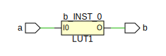
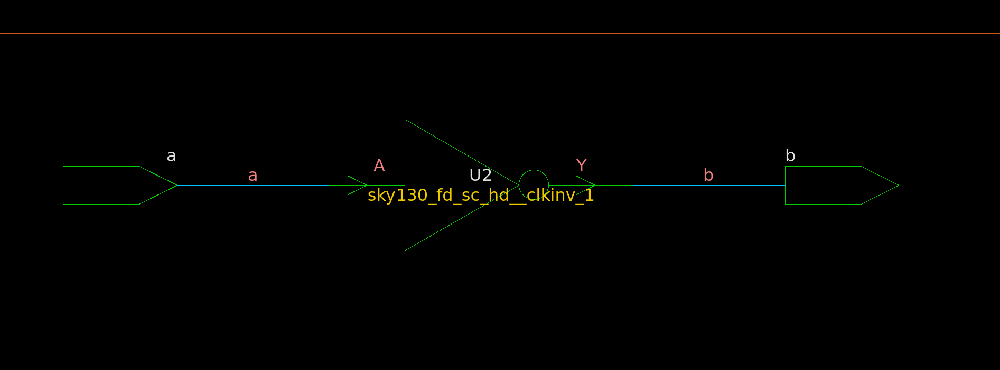

# HDL to Schematic Examples

This collection showcases examples of generating schematics from SystemVerilog code using various synthesis tools such as Yosys, Vivado, Genus, and Design Compiler.

## Synlig + Yosys + netlistsvg

1. Install the following:
   * <https://github.com/nturley/netlistsvg>
   * <https://github.com/chipsalliance/synlig>

2.

```bash
cd yosys
make
```


## Vivado

1. Download Vivado: <https://www.xilinx.com/support/download.html>

2.

```bash
cd vivado
make
```



## Genus

```bash
cd genus
make
```


## Design Compiler

```bash
cd design_compiler
make
```


