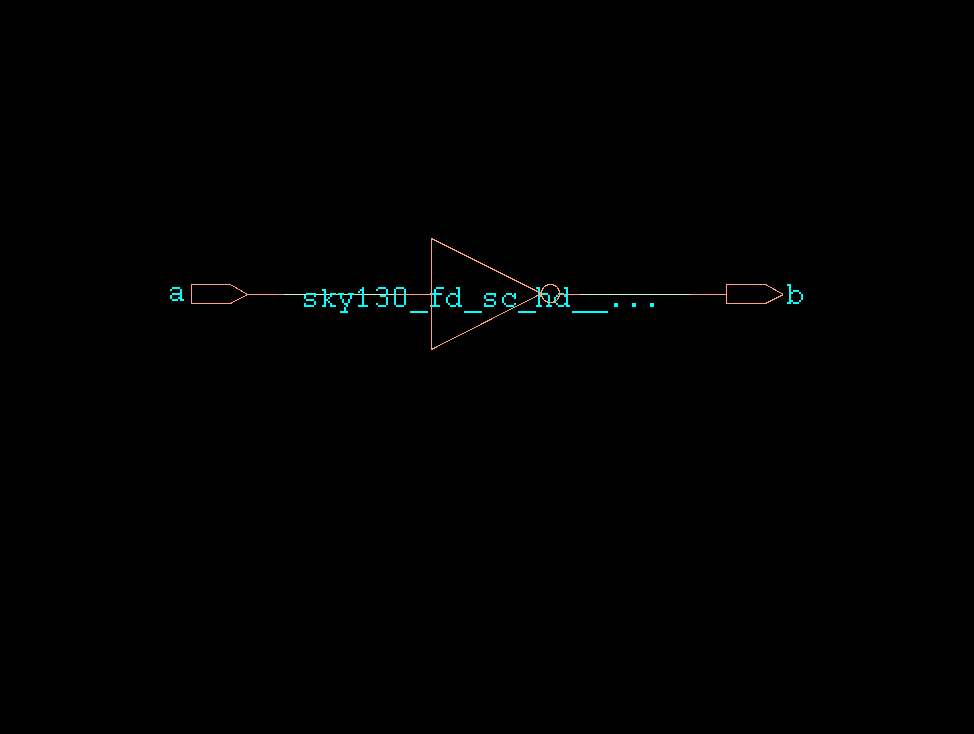

# HDL to Schematic Examples

This collection showcases examples of generating schematics from SystemVerilog code using various synthesis tools like Yosys, Vivado, Genus, and Design Compiler.

## Synlig + Yosys + netlistsvg

1. Install the following:
   * <https://github.com/nturley/netlistsvg>
   * <https://github.com/chipsalliance/synlig>

2.

```bash
cd genus
make
```


## Vivado

*TODO*

## Genus

1. Download the [Skywater PDK](https://github.com/google/skywater-pdk) and generate the liberty files.

2.

```bash
cd genus
make
```



## Design Compiler

*TODO*
